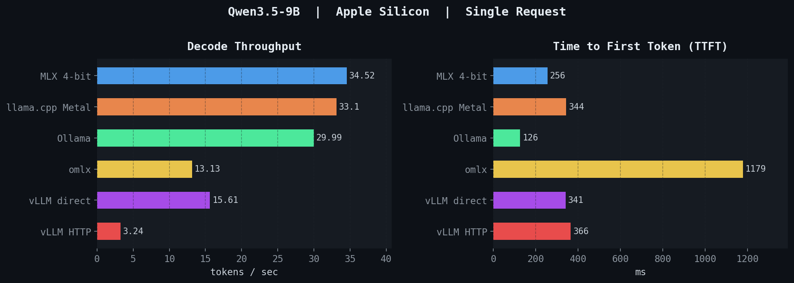
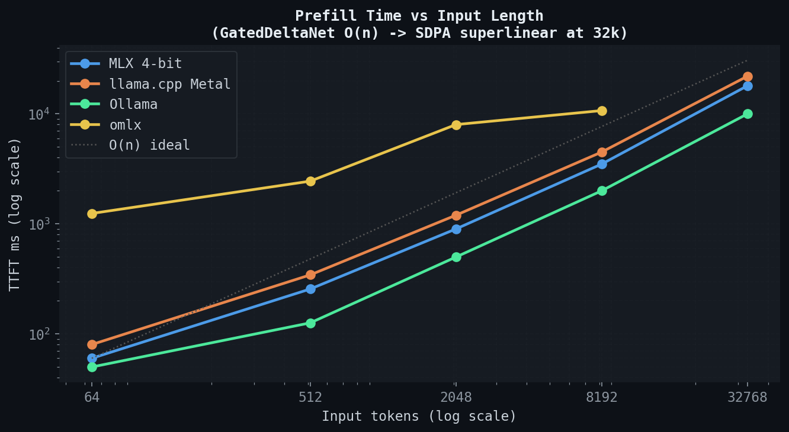
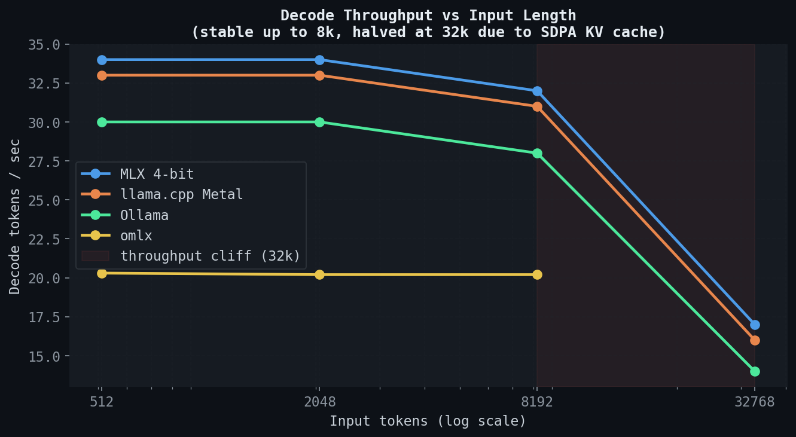
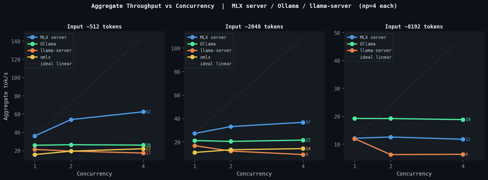

# Apple Silicon LLM Inference Benchmark

Benchmarks for Qwen3.5-9B inference across MLX, llama.cpp, Ollama, omlx, and vLLM Metal on Apple Silicon.

## Single-Request Throughput



## Prefill Time (TTFT) vs Input Length



MLX, llama.cpp, and Ollama grow near-linearly up to 8k (GatedDeltaNet O(n) linear attention). omlx's continuous-batching path adds a fixed per-request scheduling cost and runs noticeably slower than raw MLX at every input length.

## Decode Throughput vs Input Length



MLX/llama.cpp/Ollama decode stays stable up to 8k then ~halves at 32k. omlx decode is flat near 20 tok/s across 512–8k — about 60% of raw MLX due to the server's continuous-batching bookkeeping, but unlike the other backends it doesn't collapse with input length.

## Concurrency



Ollama, MLX server, and llama-server are flat under concurrency — `NUM_PARALLEL` controls queue depth, not batching. **omlx actually batches**: aggregate throughput grows from 15.6 → 21.9 tok/s at 512 input (1.40×) and 11.2 → 14.4 tok/s at 2048 input (1.29×) as concurrency goes from 1 → 4. TTFT grows with queue depth on every backend, including omlx.

Full report: [`results/benchmark_report.md`](results/benchmark_report.md)

## Key Findings

- **MLX and llama.cpp Metal** win single-request throughput (~34 vs ~33 tok/s)
- **Ollama** has the best single-request TTFT (126 ms) — persistent server keeps model warm
- **omlx** is ~40% slower single-request than raw MLX (13 vs 34 tok/s) — the cost of HTTP + continuous-batching — but is the **only** backend here with real per-request batching; aggregate throughput scales 1.3–1.4× with concurrency while others stay flat
- **omlx** decode stays flat at ~20 tok/s as input length grows, while MLX/Ollama/llama.cpp collapse from ~34 → ~17 at 32k
- **vLLM Metal HTTP** adds 4.8× overhead vs direct library call; bf16 vs 4-bit adds another 2.2× (~10× total vs MLX)
- **Qwen3.5 GatedDeltaNet** linear attention gives near-O(n) prefill but breaks batching in Ollama/MLX/llama.cpp

## omlx on Qwen3.5: upstream bug fix

omlx 0.3.6 crashes with `RuntimeError: There is no Stream(gpu, 0) in current thread` when running Qwen3.5 (RotatingKVCache path). Root cause: `mlx_lm.generate.generation_stream` is created in the main thread at import time, but omlx's single-worker `ThreadPoolExecutor` has no Metal stream — arrays produced inside `with mx.stream(generation_stream):` blocks then fail at `.item()` in the executor thread.

Fix — add a thread `initializer` that replaces `generation_stream` with a stream created in the executor thread. Clean patch (~15 lines) lives in [`~/Documents/GitHub/omlx-fork/omlx/engine_core.py`](https://github.com/jundot/omlx/compare/main) pending PR to `jundot/omlx`.

## Setup

```bash
uv sync
```

### Models

```bash
# MLX 4-bit
uv run mlx_lm.convert --model Qwen/Qwen3.5-9B -q --mlx-path ./models/qwen3.5-9b-mlx-4bit

# llama.cpp GGUF
hf download unsloth/Qwen3.5-9B-GGUF --include "Qwen3.5-9B-Q4_K_M.gguf" --local-dir ./models/

# Ollama
ollama pull qwen3.5:9b

# omlx (requires the upstream fix above applied)
brew install omlx
ln -s $(pwd)/models/qwen3.5-9b-mlx-4bit ~/.omlx/models/
brew services start omlx

# vLLM Metal
curl -fsSL https://raw.githubusercontent.com/vllm-project/vllm-metal/main/install.sh | bash
```

## Usage

```bash
# Single-request throughput (all backends)
uv run python benchmark.py

# Individual backends
uv run python backends/bench_mlx.py
uv run python backends/bench_ollama.py
uv run python backends/bench_llamacpp.py
uv run python backends/bench_omlx.py
uv run python backends/bench_vllm_metal.py
uv run python backends/bench_vllm_metal_direct.py

# Prefill vs decode breakdown by input length
uv run python backends/bench_prefill_decode.py --backends mlx,ollama,llamacpp,omlx

# Concurrency throughput
uv run python backends/bench_concurrency.py --backends ollama,mlx,llamacpp,omlx --levels 1,2,4
```
